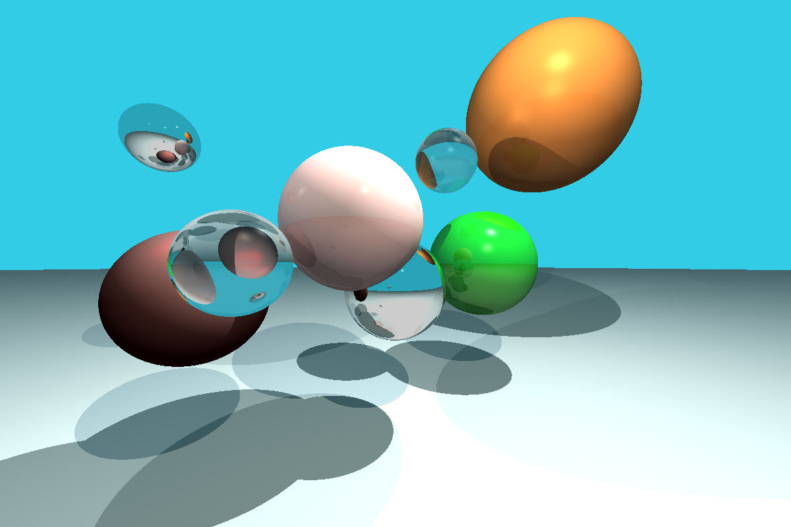

# Monad Tracer

This project is a small Ray Tracer written in Haskell from scratch. It is a port of one of [my previous projects](https://github.com/daniilsjb/RayTracer), which was originally written in C++ with SFML. This version doesn't introduce any new features or optimizations (in fact it is slower and is not a pixel-perfect copy of the original version), and is intended primarily as a fun exercise to see how a functional program would differ from an equivalent imperative one.

## Technique

The Ray Tracing itself is pretty basic, it uses Phong reflection model with recursive reflections and refractions, and the output is rendered to a `.ppm` file, which can then be converted into a different format using 3rd party tools. The following is an example of the produced image:

The scene itself is described in code and can be changed. Camera settings may be adjusted as well, and new materials are easy to add. To add new object types one would only need to provide their ray-intersection functions.

## Compilation

To compile this project with GHC, you may use the following command:

`ghc --make -outputdir build/temp -o build/tracer -isrc src/Main.hs`

Note that the `build` directory must already exist.

## Running

This program may be run as a console application (for example, via the command prompt on Windows) since it only needs to produce an output file, but it also reports the time it took to perform ray tracing into the standard output.
